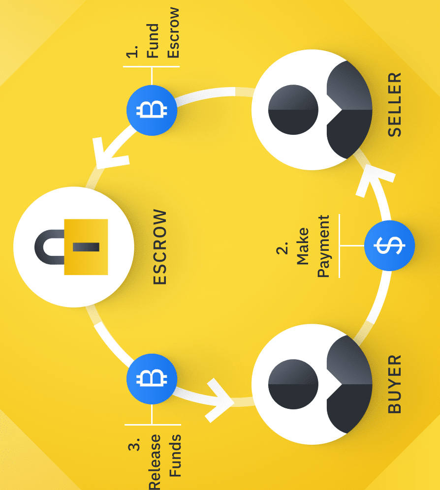
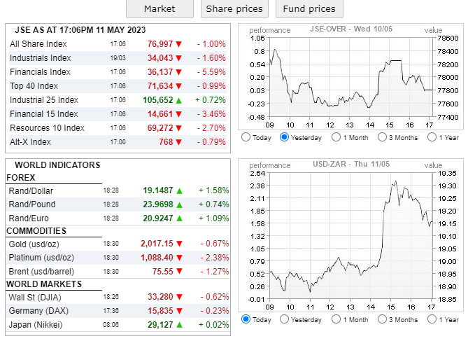
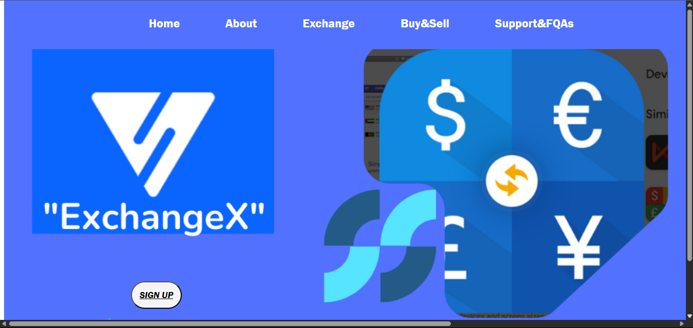
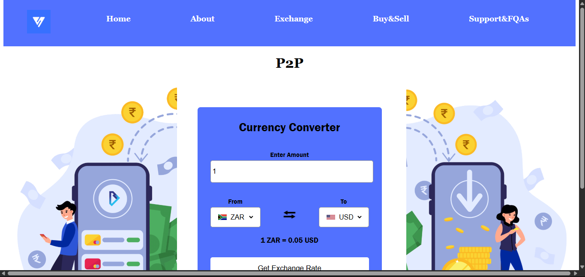
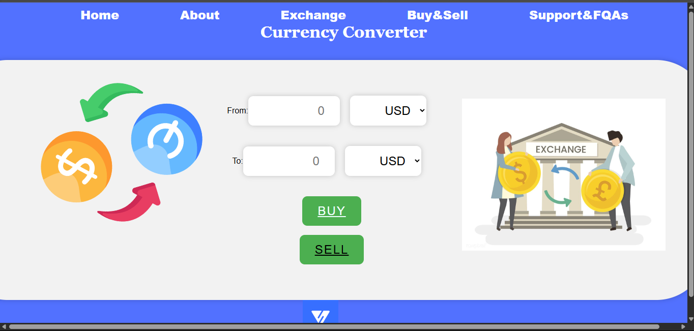
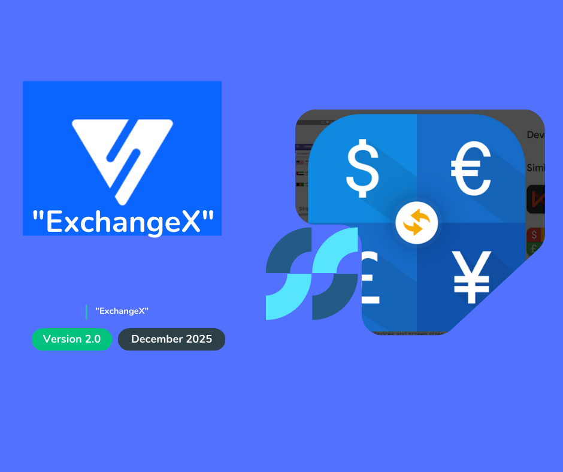

# ExchangeX - Modern Currency Exchange Platform


ExchangeX is a comprehensive financial platform that revolutionizes how people exchange currencies and perform peer-to-peer transactions. Built with modern web technologies, it provides a secure, efficient, and user-friendly solution for all your currency exchange needs.

## 🌟 Features

### 1. Currency Exchange
- Real-time currency conversion
- Support for multiple currencies worldwide
- Live market rates and updates
- User-friendly interface for quick exchanges


### 2. P2P Transactions
- Direct peer-to-peer money transfers
- Secure transaction processing
- Escrow service for added security
- International transfers supported



### 3. Market Information
- Live market rates and trends
- Currency performance analytics
- Historical exchange rate data
- Market news and updates



### 4. Security Features
- End-to-end encryption
- Secure user authentication
- Transaction verification
- Anti-fraud protection

## 💻 Technology Stack

- Frontend: HTML5, CSS3, JavaScript
- Real-time Updates: JavaScript APIs
- Security: SSL/TLS encryption
- Responsive Design: Mobile-first approach

## 🚀 Getting Started

1. Clone the repository:
```bash
git clone https://github.com/yourusername/ExchangeX.git
```

2. Open the project in your preferred web browser:
```bash
cd ExchangeX
open index.html
```

## 📱 User Interface

### Home Page


### Exchange Interface


### Transaction History


## 🔒 Security

ExchangeX prioritizes the security of your transactions:
- Secure user authentication
- Encrypted data transmission
- Regular security audits
- Compliance with financial regulations



## 💳 Payment Methods

We support various payment methods:
- Bank transfers
- Credit/Debit cards
- Digital wallets
- Cryptocurrency (coming soon)


## 🌍 Supported Countries

ExchangeX is available in multiple countries with support for local currencies and regulations. Our platform complies with international financial standards and local regulations in each operating country.


## 📞 Support

For any queries or assistance:
- Email: support@exchangex.com
- Phone: +1-XXX-XXX-XXXX
- Live Chat: Available 24/7


## 👥 Team

ExchangeX is developed and maintained by a team of experienced developers:
- Liyema Swartbooi (202323390) - Web Developer
- Letsego David Makomane (202228370) - Frontend Developer
- Oduetse Modungwa (202310828) - Frontend Developer
- Paul Christephor Kruger (202302077) - Frontend Developer
- Amogelang Swarts (202335427) - Frontend Developer
- Kabelo Montsane (202318383) - Frontend Developer

## 📄 License

This project is licensed under the MIT License - see the [LICENSE](LICENSE) file for details.

## 🤝 Contributing

We welcome contributions to ExchangeX! Please read our [Contributing Guidelines](CONTRIBUTING.md) for details on how to submit pull requests.

---

© 2023 ExchangeX. All rights reserved.
